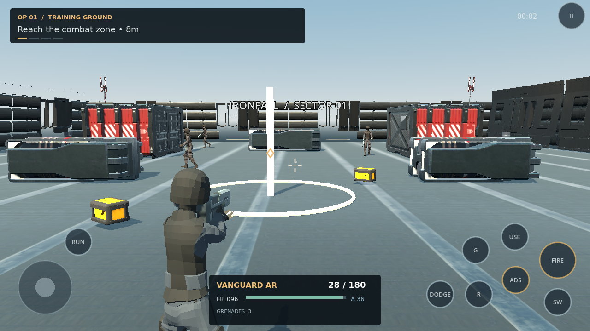

# Validation — 2026-10-02

Godot 4.6.3.stable.official.7d41c59c4 on Linux.

## Passed

- Godot resource import and script compilation.
- **97 component/integration checks, zero failures.**
- **Ten end-to-end mission playthroughs through normal controls**, on Easy with
  the standard rifle/pistol loadout and normal health/armor. The driver moves,
  aims, shoots, reloads and interacts without teleporting, changing health or
  directly damaging enemies. Each mission's reward survives save/load.
- Separate campaign integration tests exercise objective chains, waves, boss
  phases, mission locks and duplicate-reward rejection by injecting combat events.
- Three simultaneous touch IDs move/look/fire independently; touch release,
  pause and background events clear input safely.
- Armor/headshots/death and actual area damage to the player,
  semi/automatic/burst fire, reload/ammo exhaustion,
  switching, real physics hitscan and pooled grenade launch.
- Upgrade/unlock pricing, insufficient funds, upgrade stat effects, canonical
  saves, malformed JSON backup recovery and bounded save fields.
- Pause freezes simulation; resume restores it. Player death animation continues
  behind the failure overlay while combat and mission time remain frozen. Simulated Android background
  notifications pause and foreground notifications wait for explicit resume.
- Menus mount at 1280×720, 1600×720, 1024×768 and 1920×1080.
- Exported PCK launches its main scene headlessly without script/resource errors.
- Python installer syntax and shell build/test script syntax.

## Latest control-driven campaign results

Times are simulated mission times, not FPS measurements. Tactical decisions are
randomized, so individual run times vary.

| Operation | Time | Final HP | Reward |
|---|---:|---:|---|
| Training Ground | 13.8s | 100.0 | Saved |
| Enemy Outpost | 45.4s | 100.0 | Saved |
| Warehouse Assault | 18.4s | 100.0 | Saved |
| Urban Conflict | 8.3s | 100.0 | Saved |
| Night Operation | 14.8s | 100.0 | Saved |
| Military Compound | 23.7s | 100.0 | Saved |
| Rescue Signal | 15.0s | 100.0 | Saved |
| Survival Assault | 19.4s | 100.0 | Saved |
| Elite Stronghold | 27.0s | 100.0 | Saved |
| The Warden | 11.0s | 80.7 | Saved |

## Android verification

Human tactical build **0.2.1**, version code **3**, commit
`185bd76306c8fff39b3d3235d37cad0d37cf18ce`:
[GitHub Actions run 37074024404](https://github.com/umardevexpert/Shooting-game/actions/runs/37074024404).
Both build and Android emulator jobs completed successfully.

- Exported APK passes ZIP integrity, signature v2, package and arm64/x86_64 checks.
- API 35 Android launch, real touch menu/campaign/loadout navigation and rendered
  3D mission frame validation pass.
- Native ADS/fire/reload, pause/resume, Home/foreground pause, local save and
  process restart checks pass.
- Actual Android screenshots were inspected: a clothed rigged human holds the
  firearm in a designed 3D arena with human enemies, props, lighting and shadows.
- No script/resource/engine typed-array or menu-transition errors appear in the
  Android device log. One cached-shader warning on process restart is recovered
  by recompilation; the app returns to its main menu and restores the save.

[Download APK artifact](https://github.com/umardevexpert/Shooting-game/actions/runs/37074024404/artifacts/11255083175)
(about 70 MB ZIP; unzip to install the development APK).
[Screenshots/log artifact](https://github.com/umardevexpert/Shooting-game/actions/runs/37074024404/artifacts/11255489568).
Screenshots are unedited emulator captures, not concept renders.

## Licensed asset validation

56 third-party assets have complete manifest entries and matching SHA-256 hashes.
The current playable operator/enemies are actual clothed skinned humans, with
49 weighted joints and 22 retargeted/derived clips. A civilian is used for rescue.
Tests verify skinning, hand sockets, both-hand grip IK and camera-aligned barrels, eight distinct imported
firearm models, physical-muzzle hitscan, locomotion pose changes and matching
visual/collider scale. These are free low-poly/stylized models; dedicated weapon
reloads, detailed character/weapon materials and the final art pass are outstanding.
A pose captured from the live Godot skeleton was rendered and inspected for grip
alignment; actual Android mission/ADS/fire screenshots were also inspected.

## Remaining release verification

Physical touch latency, haptics, audible sound/music, device cutouts, minimum-API
compatibility and GPU/thermal/battery/memory benchmarks require physical devices.
60 FPS is a target rather than a measured result. Emulator software rendering is
not a mobile GPU performance benchmark. Human balancing, animation polish,
additional environment variety and accessibility review remain release work.
Precise automated aiming is not representative of typical player skill.

## Evidence

- `build/aim-alignment-verification.log`: 97 checks and ten control-driven mission runs.
- GitHub Actions APK, test/build logs and Android screenshot/log artifacts.
- `assets/manifest.json`: actual imported assets, licenses and checksums.

Local editor logs contain `_sock == -1` / `ERR_CANT_CREATE` from the optional
sandbox-restricted debug listener. Gameplay validation fails on script or missing
resource errors and reports none in the passing run.
